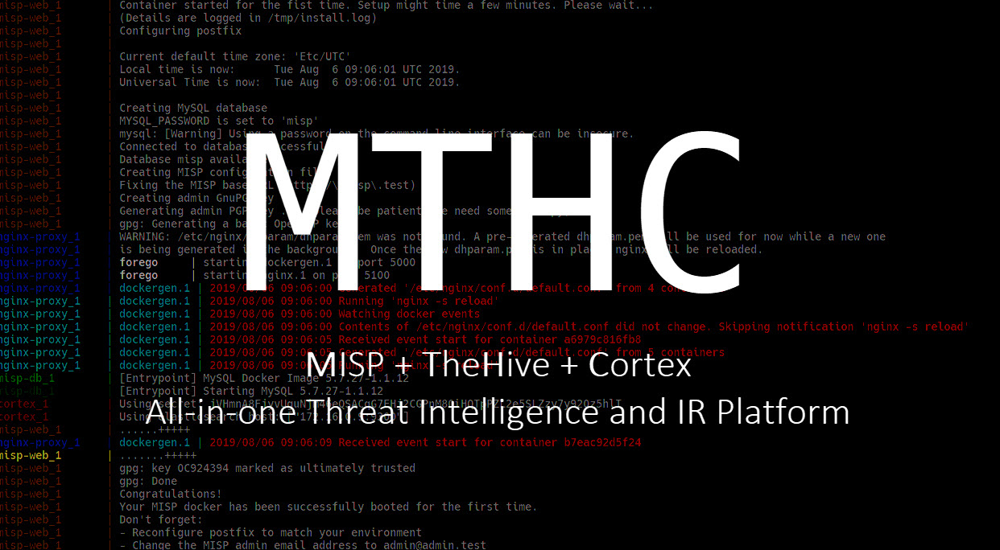

  

# mthc 

**mthc** orginally came from **M**ISP, **T**heHive and **C**ortex. It is intentionally built to automatically deploy [MISP](https://www.misp-project.org/), [TheHive](https://thehive-project.org/#section_thehive) and [Cortex](https://thehive-project.org/#section_cortex) in one shot. By the way, due to limitiation from each platform, I cannot find a way truly automate the build process without manual configuration. Some processes such as registration and grabbing/providing API keys still required human interaction.

**mthc** comes with built-in reverse proxy that can be used to support either plain HTTP or HTTP with SSL/TLS. [FiloSottile/mkcert](https://pe3zx.blogspot.com/2019/01/deploy-your-own-local-misp-with-https.html) provides a simple way to generate locally trusted certificates for testing.

## Status

**mthc** depends on components to build. These are including [my misp-docker](https://github.com/pe3zx/misp-docker), TheHive image, Cortex image in mandatory.

To ensure about project's integrity, **mthc** is configured for build verification test by [Actions workflow](https://github.com/pe3zx/mthc/actions/workflows/build_check.yml). All dependencies are pulled, built and checked each of service' status every month. I will be notified if something goes wrong.

## Deployment

See [Deployment page on Wiki](https://github.com/pe3zx/mthc/wiki/Deployment) for deployment instructions and require parameters

## License

See [LICENSE](/LICENSE)
