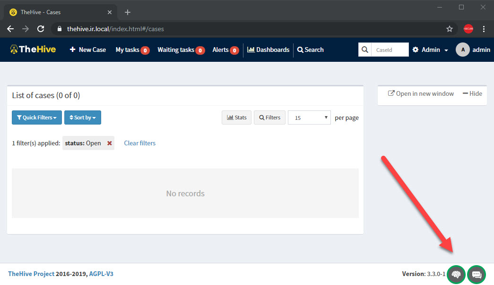

<p align="center">
  
</p>


# mthc

**mthc** orginally came from **M**ISP, **T**heHive and **C**ortex. It is intentionally built to automatically deploy [MISP](https://www.misp-project.org/), [TheHive](https://thehive-project.org/#section_thehive) and [Cortex](https://thehive-project.org/#section_cortex) in one shot. By the way, due to limitiation from each platform, I cannot find a way truly automate the build process without manual configuration. Some processes such as registration and grabbing/providing API keys still required human interaction.

**mthc** comes with built-in reverse proxy that can be used to support either plain HTTP or HTTP with SSL/TLS. [FiloSottile/mkcert](https://pe3zx.blogspot.com/2019/01/deploy-your-own-local-misp-with-https.html) provides a simple way to generate locally trusted certificates for testing.


## Deployment

> The current domain name is `*.ir.local`. Replace `*.ir.local` in the instruction with you domain name during deployment process

1. Install the latest stable version of `docker` and `docker-compose`

```
# Download and install Docker with get-docker.sh
curl -fsSL https://get.docker.com -o get-docker.sh && sh get-docker.sh

# Add current user to docker group
sudo usermod -aG docker $USER

# Download and setup docker-compose
sudo curl -L "https://github.com/docker/compose/releases/download/1.24.0/docker-compose-$(uname -s)-$(uname -m)" -o /usr/local/bin/docker-compose
sudo chmod +x /usr/local/bin/docker-compose
sudo ln -s /usr/local/bin/docker-compose /usr/bin/docker-compose
```

2. Update parameters in `docker-compose.yml` as follows:
    - **nginx-proxy**: if you want to access via HTTPS, certificate and keys must be added to `./certs/`. Name of certificates and keys must be the same as name of virtual hosts specified on `VIRTUAL_HOST` for example, `misp.ir.local.crt` and `misp.ir.local.key` for `misp.ir.local`.  See more information about SSL/TLS configuration on [jwilder/nginx-proxy](https://github.com/jwilder/nginx-proxy)
    - **misp-db**: Update
        - `MYSQL_USER` for MySQL user
        - `MYSQL_PASSWORD` for MySQL password
        - `MYSQL_ROOT_PASSWORD` for MySQL root password
    - **misp-web**: Update
        - `MYSQL_USER` for MySQL user as specified on `misp-db`
        - `MYSQL_PASSWORD` for MySQL password as specified on `misp-db`
        - `MISP_ADMIN_EMAIL` for username and login email
        - `MISP_ADMIN_PASSPHRASE` for administrator password
        - `MISP_BASEURL` for base URL to access the instance
        - `TIMEZONE` for the accurate date and time
    - **VIRTUAL_HOST**: update `VIRTUAL_HOST` environment variable to a domain name you want to make available.
3. On `./conf/cortex.conf`, make changes with the following lines:
    - `play.http.secret.key` for the secret key used in secure cryptographic functions
    - `path` for Cortex-Analyzers if there is any change
4. On `./conf/thehive.conf`, make changes with the following lines:
    - `play.http.secret.key` for the secret key used in secure cryptographic functions
    - `play.ws.ssl.loose.acceptAnyCertificate` to `true` if there is no SSL/TLS configuration
5. Increase limits on `mmapfs` on host for Elasticsearch with

```
echo -e "vm.max_map_count=262144" | sudo tee -a /etc/sysctl.conf
sudo sysctl -p
```

6. Deploy services on `docker-compose.yml`

```
docker-compose.yml up -d
```

7. **MISP API key**
    - Access `misp.ir.local` with specified credentials. If it doesn't work, try with `admin@admin.test` and `admin`.
    - MISP will generate API token for administrator account only after a user is login. You can either create and use API token of a new account or use administrator's token for testing purpose. Logging in and grabbing the token at `https://misp.ir.local/users/view/me` or `https://misp.ir.local/events/automation`
8. **Cortex API key**
    - Access `cortex.ir.local` to create a new administrator account
    - On `https://cortex.ir.local/index.html#!/admin/users`, you can either create a new account with API key or create a new API key on administrator account
9. **TheHive API key and configuration**
    - On `./conf/thehive.conf`, update Cortex API key on line 138
    - On `./conf/thehive.conf`, update MISP API key on line 166
    - On host, restart `mthc_thehive_1` container to enforce new setting
    - Check for green lights on TheHive dashbaord, MISP and Cortex integration should be enabled now.
10. DONE!

<p align="center">
  
</p>

## License

See [LICENSE](/LICENSE)